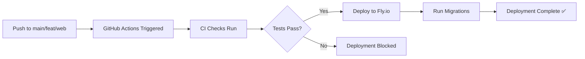

# GitHub Actions CI/CD Setup Guide

## 🎯 What's Been Set Up

Two GitHub Actions workflows have been created for you:

### 1. **CI Workflow** (`.github/workflows/ci.yml`)
- ✅ Runs on every PR and push to `main` or `feat/web`
- ✅ Type checks for both server and web
- ✅ Runs server tests
- ✅ Builds web app
- ✅ Uses pnpm caching for faster builds

### 2. **Deploy Workflow** (`.github/workflows/deploy.yml`)
- 🚀 Auto-deploys to Fly.io on push to `main` or `feat/web`
- 🗄️ Automatically runs database migrations after deployment
- ⏭️ Skips if commit message contains `[skip ci]`
- 📁 Only triggers when server files change

---

## 🔐 Required Setup Steps

### Step 1: Get Your Fly.io API Token

```bash
# Generate a Fly.io API token
flyctl auth token
```

This will output a token like: `fo1_xxxxxxxxxxxxxxxxxxxx`

### Step 2: Add GitHub Secret

1. Go to your GitHub repository
2. Click **Settings** → **Secrets and variables** → **Actions**
3. Click **New repository secret**
4. Name: `FLY_API_TOKEN`
5. Value: Paste the token from Step 1
6. Click **Add secret**

---

## 🚀 How It Works

### Automatic Deployment Flow



### What Happens When You Push

1. **Code pushed to GitHub**
   ```bash
   git push origin feat/web
   ```

2. **CI workflow runs** (in parallel)
   - Server type checking
   - Server tests
   - Web type checking
   - Web build

3. **If CI passes, Deploy workflow runs**
   - Deploys server to Fly.io
   - Waits 10 seconds for app to stabilize
   - Runs `pnpm db:migrate` automatically
   - Reports success/failure

### Skipping CI/Deployment

If you want to push without triggering deployment:

```bash
git commit -m "docs: update README [skip ci]"
git push
```

---

## 📋 Workflow Details

### CI Workflow

**Triggers:**
- Pull requests to `main` or `feat/web`
- Pushes to `main` or `feat/web`

**Jobs:**
- `server-checks`: Type check & tests for server
- `web-checks`: Type check & build for web

**Features:**
- ⚡ Fast builds with pnpm caching
- 🔄 Runs in parallel for speed
- ✅ Blocks PRs if checks fail

### Deploy Workflow

**Triggers:**
- Push to `main` or `feat/web`
- Only when server files change
- Skips if commit has `[skip ci]`

**Steps:**
1. Checkout code
2. Setup Fly CLI
3. Deploy to Fly.io
4. Wait for deployment to stabilize
5. Run database migrations
6. Report status

**Safety Features:**
- ⏸️ Waits 10 seconds before running migrations
- 🛑 Stops if deployment fails
- 📝 Clear success/failure messages

---

## 🔧 Customization

### Deploying to Different Fly.io Apps

If you have staging/production apps:

**Option 1: Branch-based deployment**

Edit `.github/workflows/deploy.yml`:

```yaml
- name: Deploy to Fly.io (Production)
  if: github.ref == 'refs/heads/main'
  run: flyctl deploy --remote-only --app kompa-server-prod

- name: Deploy to Fly.io (Staging)
  if: github.ref == 'refs/heads/feat/web'
  run: flyctl deploy --remote-only --app kompa-server-staging
```

**Option 2: Manual approval for production**

Add to deploy workflow:

```yaml
- name: Wait for approval
  if: github.ref == 'refs/heads/main'
  uses: trstringer/manual-approval@v1
  with:
    secret: ${{ secrets.GITHUB_TOKEN }}
    approvers: your-github-username
```

### Change Deployment Trigger

To deploy only on `main` pushes:

```yaml
on:
  push:
    branches:
      - main  # Remove feat/web
```

To deploy manually only:

```yaml
on:
  workflow_dispatch:  # Manual trigger only
```

### Add Slack Notifications

Add to the end of deploy workflow:

```yaml
- name: Notify Slack
  if: always()
  uses: 8398a7/action-slack@v3
  with:
    status: ${{ job.status }}
    webhook_url: ${{ secrets.SLACK_WEBHOOK }}
```

### Running Migrations Before Deployment

If you need to run migrations BEFORE deploying new code:

```yaml
- name: Run Database Migrations (Pre-deploy)
  run: flyctl ssh console -a kompa-server -C "pnpm db:migrate"

- name: Deploy to Fly.io
  run: flyctl deploy --remote-only
```

---

## 🐛 Troubleshooting

### Deployment fails with "unauthorized"

**Problem:** FLY_API_TOKEN is missing or invalid

**Fix:**
```bash
# Generate new token
flyctl auth token

# Update GitHub secret
# Go to Settings → Secrets → Actions → Edit FLY_API_TOKEN
```

### Migrations fail

**Problem:** Database connection issues or migration errors

**Fix:**
```bash
# Check app logs
flyctl logs -a kompa-server

# Manually run migrations
flyctl ssh console -a kompa-server
pnpm db:migrate

# Check database
psql $DATABASE_URL
SELECT * FROM __drizzle_migrations;
```

### Workflow doesn't trigger

**Problem:** Changes not in `server/` directory

**Solution:** The deploy workflow only triggers when server files change. To deploy anyway:

```bash
git commit --allow-empty -m "chore: trigger deployment"
git push
```

Or modify `.github/workflows/deploy.yml` and remove the `paths` filter.

### CI checks fail but you need to deploy

**Bad practice, but if urgent:**

```bash
git commit -m "fix: urgent hotfix [skip ci]"
git push
```

Then manually deploy:
```bash
cd server
fly deploy
flyctl ssh console -C "pnpm db:migrate"
```

---

## 📊 Monitoring Deployments

### View Workflow Runs

1. Go to your GitHub repo
2. Click **Actions** tab
3. See all workflow runs and their status

### Check Deployment Status

```bash
# View app status
flyctl status -a kompa-server

# View recent logs
flyctl logs -a kompa-server

# Check specific deployment
flyctl releases -a kompa-server
```

### Rollback if Needed

```bash
# List recent releases
flyctl releases -a kompa-server

# Rollback to previous version
flyctl releases rollback <version> -a kompa-server
```

---

## 🎓 Best Practices

### 1. Always Review Migrations

Before merging PRs with database changes:
- Review the generated SQL in `drizzle/`
- Test migrations locally
- Consider data migration impact
- Document breaking changes

### 2. Use Feature Branches

```bash
git checkout -b feat/add-user-preferences
# Make changes
git push origin feat/add-user-preferences
# Create PR - CI runs automatically
```

### 3. Protect Main Branch

GitHub Settings → Branches → Add rule:
- ✅ Require status checks to pass
- ✅ Require pull request reviews
- ✅ Include administrators

### 4. Monitor Failed Deployments

Set up notifications:
- Enable GitHub Actions notifications in your profile
- Add Slack/Discord webhooks
- Check Actions tab regularly

### 5. Database Migration Safety

For production:
- Test migrations on staging first
- Backup database before risky migrations
- Use database transactions when possible
- Plan rollback strategy

---

## 🚀 Quick Start

### First Time Setup

1. **Add Fly.io token to GitHub:**
   ```bash
   flyctl auth token  # Copy this
   ```
   Add to GitHub: Settings → Secrets → Actions → `FLY_API_TOKEN`

2. **Test the workflow:**
   ```bash
   git checkout -b test/github-actions
   echo "test" >> README.md
   git add README.md
   git commit -m "test: github actions setup"
   git push origin test/github-actions
   ```

3. **Check Actions tab:**
   - Go to GitHub → Actions
   - Watch CI workflow run
   - Verify it completes successfully

4. **Merge and deploy:**
   ```bash
   git checkout feat/web
   git merge test/github-actions
   git push origin feat/web
   ```
   - Watch both CI and Deploy workflows run
   - Verify deployment succeeds
   - Check Fly.io app is running

### Daily Workflow

```bash
# Make changes
git add .
git commit -m "feat: add user preferences"
git push

# GitHub Actions automatically:
# 1. Runs CI checks
# 2. Deploys to Fly.io (if on main/feat/web)
# 3. Runs migrations
# 4. Reports success

# You just code and push! 🎉
```

---

## 📝 Summary

### What You Get

✅ **Automated Testing**: Every push runs tests
✅ **Automated Deployment**: Push to deploy
✅ **Automated Migrations**: No manual migration steps
✅ **Safety Checks**: CI must pass before deploy
✅ **Fast Feedback**: See results in minutes
✅ **Easy Rollback**: One command to revert

### What You Need to Do

1. Add `FLY_API_TOKEN` to GitHub Secrets (one time)
2. Push your code (that's it!)

### What You Don't Need to Do Anymore

❌ Manually run `fly deploy`
❌ Manually SSH and run migrations
❌ Remember deployment steps
❌ Worry about forgetting migrations

---

## 🆘 Need Help?

- **GitHub Actions Docs**: https://docs.github.com/actions
- **Fly.io Docs**: https://fly.io/docs/
- **Check workflow file**: `.github/workflows/deploy.yml`
- **View logs**: GitHub Actions tab in your repo

---

## 🎉 You're All Set!

Your CI/CD pipeline is ready. Just:

1. Add the Fly.io token to GitHub Secrets
2. Push your code
3. Watch the magic happen! ✨

No more manual deployments or forgotten migrations. Focus on building features, let GitHub Actions handle the rest!
